# データフロー図

## システム全体データフロー

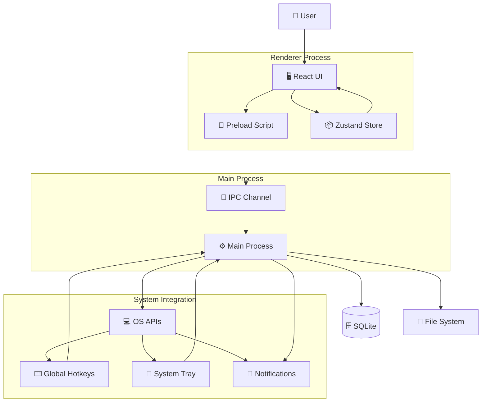

## メモ操作フロー

### 1. メモ作成フロー

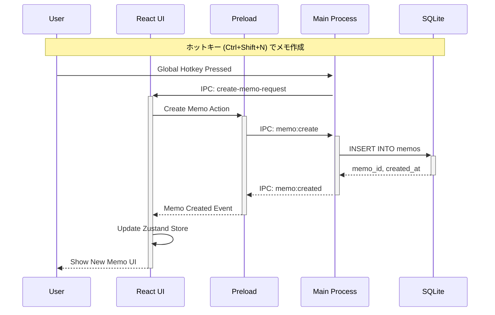

### 2. メモ編集フロー

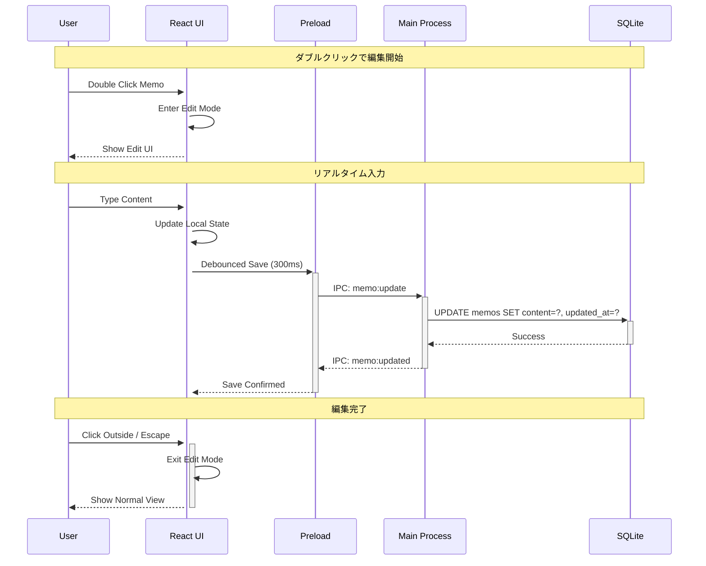

### 3. ドラッグ&ドロップフロー

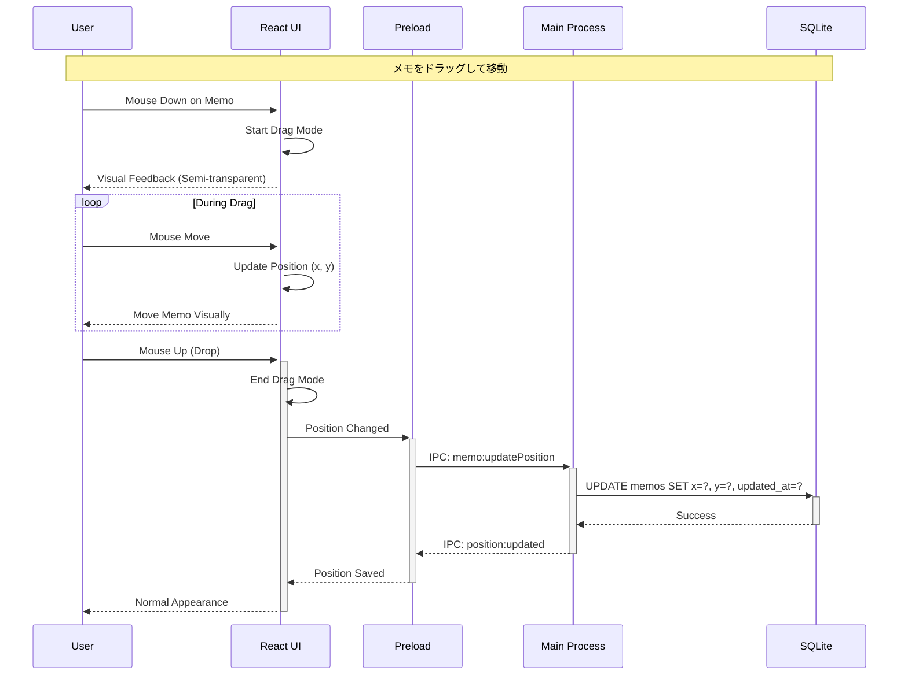

### 4. プレビュー表示フロー

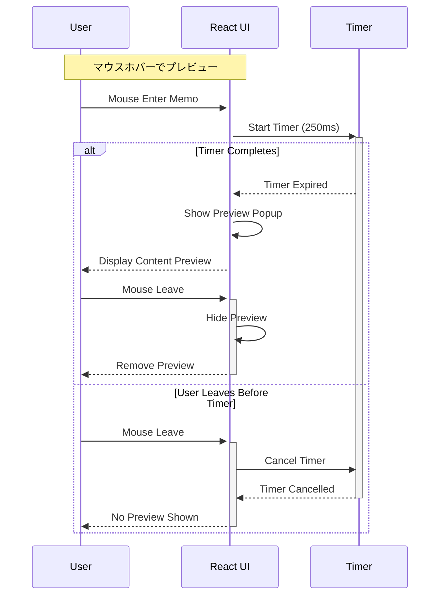

## データ同期パターン

### Optimistic Updates Pattern

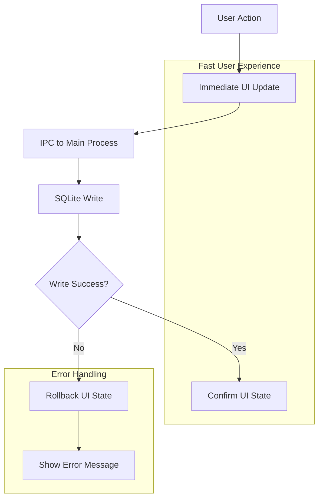

### Event-Driven Updates

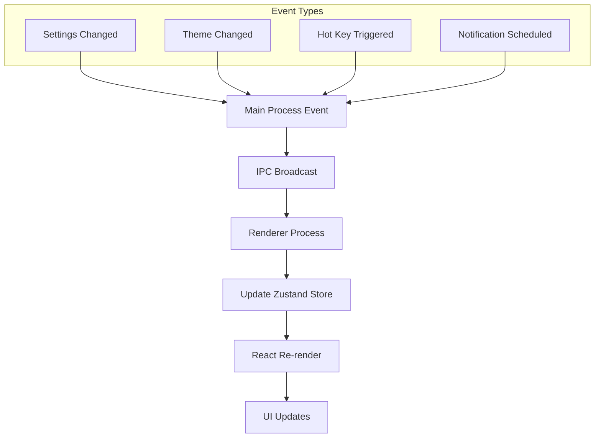

## IPC通信パターン

### Request-Response Pattern

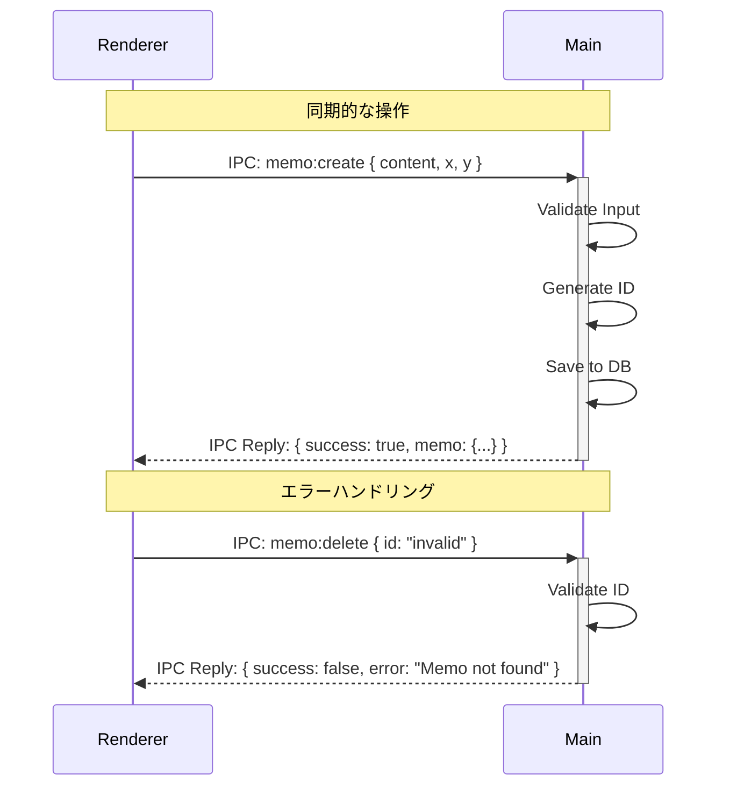

### Event Broadcasting Pattern

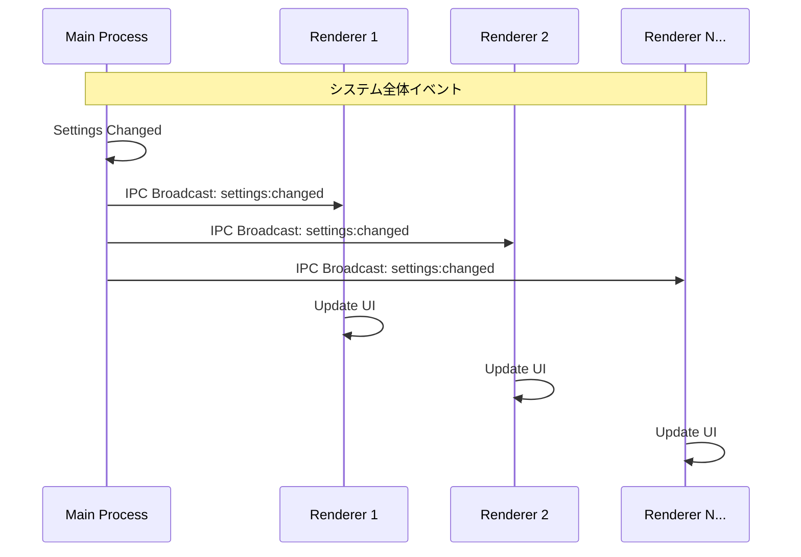

## エラーハンドリングフロー

### Database Error Handling

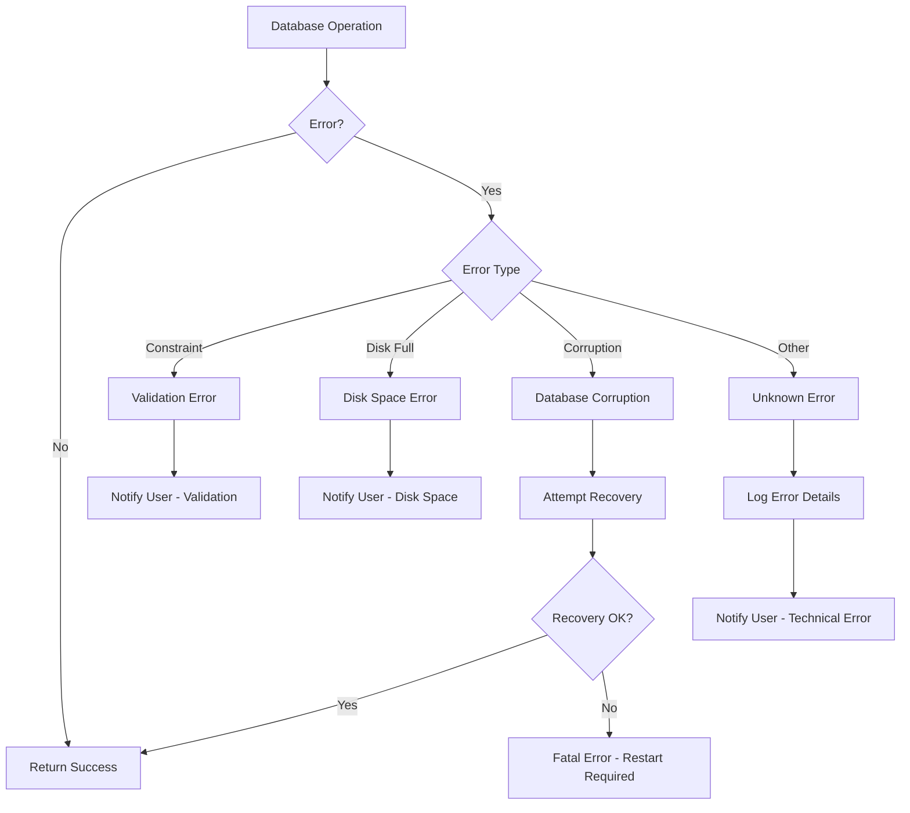

### UI Error Boundaries

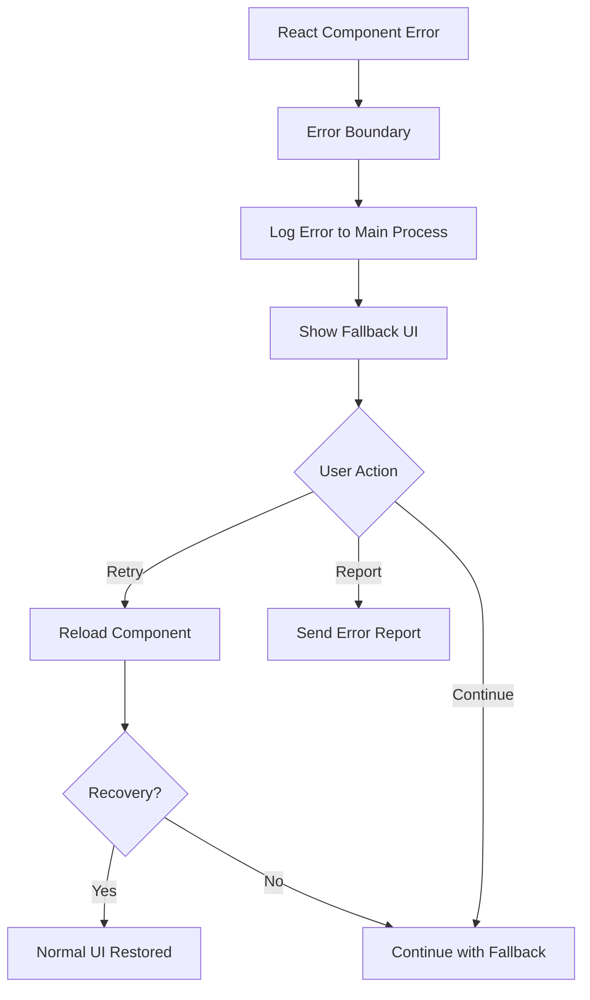

## パフォーマンス最適化フロー

### Virtual Scrolling for Large Memo Sets

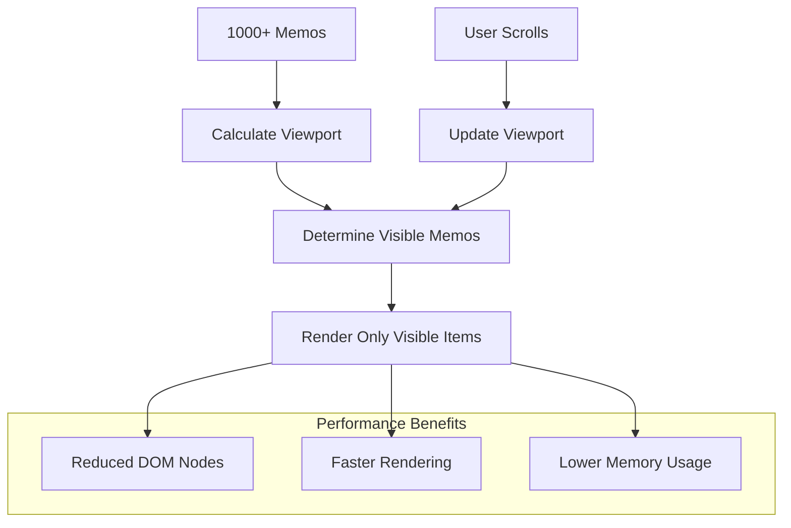

### Debounced Updates

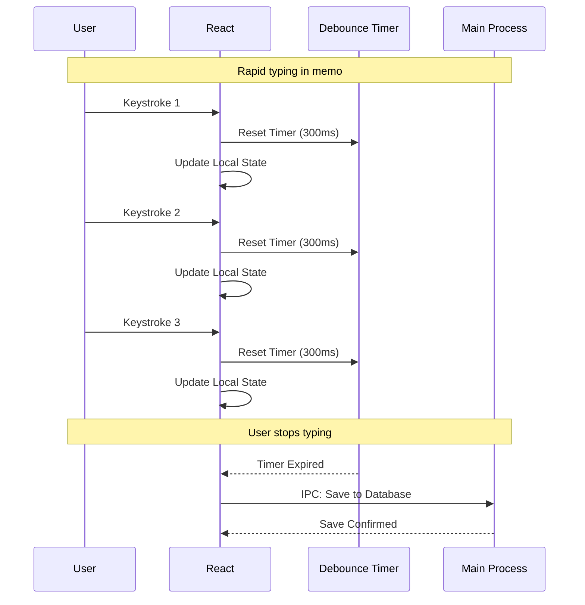

このデータフローにより、レスポンシブで安定したユーザー体験を実現しつつ、効率的なデータ管理を行います。