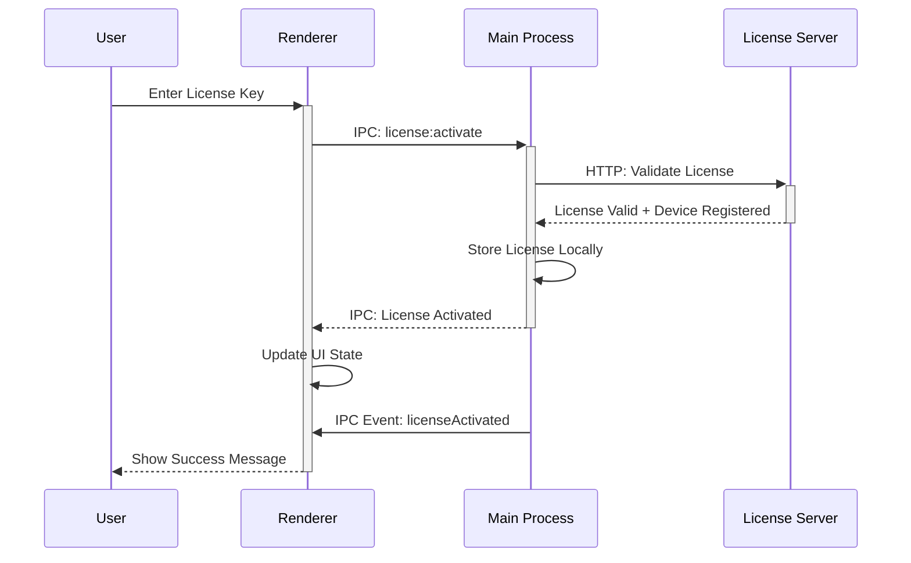
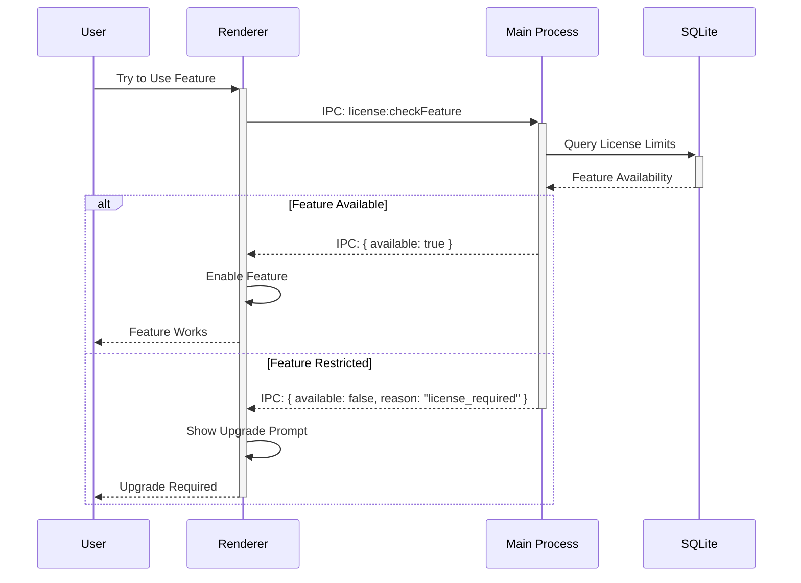

# IPC通信エンドポイント仕様

## 概要

ElectronアプリケーションにおけるMainプロセスとRendererプロセス間のIPC（Inter-Process Communication）通信の詳細仕様です。型安全性とエラーハンドリングを重視した設計となっています。

## IPC通信パターン

### 1. Request-Response パターン
- Rendererからの同期的な操作要求
- Mainプロセスでの処理実行後、結果を返却
- `IPCResponse<T>`型での統一レスポンス形式

### 2. Event Broadcasting パターン  
- Mainプロセスからの非同期イベント通知
- 複数のRendererに対する一斉配信
- 状態変更の即座な反映

### 3. Stream パターン
- 大量データの段階的送信
- プログレス通知付き処理
- メモリ効率的なデータ転送

## メモ操作エンドポイント

### memo:create
新規メモを作成します。

**チャンネル**: `memo:create`

**リクエスト**:
```typescript
interface CreateMemoRequest extends CreateMemoInput {
  // CreateMemoInputから継承
  content?: string;
  x: number;
  y: number;
  width?: number;  // デフォルト: 200
  height?: number; // デフォルト: 150
  opacity?: number; // デフォルト: 1.0
  priority?: number; // デフォルト: 3
  backgroundColor?: string; // デフォルト: '#FFEB3B'
  textColor?: string; // デフォルト: '#000000'
  fontSize?: number; // デフォルト: 14
  dueDate?: Date;
  tags?: string[];
}
```

**レスポンス**:
```typescript
IPCResponse<Memo>

// 成功例
{
  success: true,
  data: {
    id: "550e8400-e29b-41d4-a716-446655440000",
    content: "新しいメモ",
    x: 100,
    y: 100,
    width: 200,
    height: 150,
    opacity: 1.0,
    alwaysOnTop: false,
    pinned: false,
    priority: 3,
    backgroundColor: "#FFEB3B",
    textColor: "#000000",
    fontSize: 14,
    dueDate: null,
    tags: [],
    createdAt: "2024-01-15T10:30:00.000Z",
    updatedAt: "2024-01-15T10:30:00.000Z",
    isDeleted: false
  }
}

// エラー例
{
  success: false,
  error: {
    code: "MEMO_VALIDATION_ERROR",
    message: "Invalid position: x and y must be positive numbers",
    details: { x: -10, y: -20 }
  }
}
```

**バリデーション**:
- `x, y`: 0以上の整数
- `width, height`: 50-2000の範囲
- `opacity`: 0.1-1.0の範囲
- `priority`: 1-5の範囲
- `backgroundColor, textColor`: 有効なhex color形式

---

### memo:update
既存メモを更新します。

**チャンネル**: `memo:update`

**リクエスト**:
```typescript
interface UpdateMemoRequest extends UpdateMemoInput {
  id: string; // 必須
  // その他のフィールドは任意更新
}
```

**レスポンス**:
```typescript
IPCResponse<Memo>
```

**特殊処理**:
- 部分更新対応（指定されたフィールドのみ更新）
- `updated_at`は自動更新
- ピン留め状態でのposition変更は拒否

---

### memo:delete
メモを削除します（ソフト削除）。

**チャンネル**: `memo:delete`

**リクエスト**:
```typescript
interface DeleteMemoRequest {
  id: string;
  permanent?: boolean; // デフォルト: false (ソフト削除)
}
```

**レスポンス**:
```typescript
IPCResponse<{ id: string; deleted: boolean }>

{
  success: true,
  data: {
    id: "550e8400-e29b-41d4-a716-446655440000",
    deleted: true
  }
}
```

---

### memo:getAll
全てのアクティブなメモを取得します。

**チャンネル**: `memo:getAll`

**リクエスト**:
```typescript
interface GetAllMemosRequest {
  includeDeleted?: boolean; // デフォルト: false
  sortBy?: 'createdAt' | 'updatedAt' | 'priority';
  sortOrder?: 'asc' | 'desc'; // デフォルト: 'desc'
  limit?: number;
  offset?: number;
}
```

**レスポンス**:
```typescript
IPCResponse<{
  memos: Memo[];
  totalCount: number;
  hasMore: boolean;
}>
```

---

### memo:getById
IDで特定のメモを取得します。

**チャンネル**: `memo:getById`

**リクエスト**:
```typescript
interface GetMemoByIdRequest {
  id: string;
}
```

**レスポンス**:
```typescript
IPCResponse<Memo | null>
```

---

### memo:updatePosition
メモの位置を更新します（ドラッグ&ドロップ最適化）。

**チャンネル**: `memo:updatePosition`

**リクエスト**:
```typescript
interface UpdatePositionRequest {
  id: string;
  x: number;
  y: number;
}
```

**レスポンス**:
```typescript
IPCResponse<{ id: string; x: number; y: number }>
```

**最適化**:
- 高頻度呼び出しを想定した軽量処理
- バッチ更新対応（複数メモ同時移動）

---

### memo:search
メモを検索します（全文検索対応）。

**チャンネル**: `memo:search`

**リクエスト**:
```typescript
interface SearchMemosRequest extends SearchQuery {
  text?: string;
  tags?: string[];
  priority?: number[];
  dateRange?: {
    start: Date;
    end: Date;
  };
  hasDeadline?: boolean;
  sortBy?: 'createdAt' | 'updatedAt' | 'priority' | 'dueDate';
  sortOrder?: 'asc' | 'desc';
  limit?: number;
  offset?: number;
}
```

**レスポンス**:
```typescript
IPCResponse<SearchResult>
```

**検索機能**:
- SQLite FTS5による高速全文検索
- タグフィルタリング
- 日付範囲検索
- 複合検索条件

---

### memo:autoArrange
メモを自動整列します。

**チャンネル**: `memo:autoArrange`

**リクエスト**:
```typescript
interface AutoArrangeRequest {
  algorithm?: 'grid' | 'cascade' | 'priority' | 'smart';
  spacing?: number; // デフォルト: 20px
  excludePinned?: boolean; // デフォルト: true
}
```

**レスポンス**:
```typescript
IPCResponse<{
  arrangedMemos: Array<{
    id: string;
    oldPosition: Position;
    newPosition: Position;
  }>;
  totalMoved: number;
}>
```

**整列アルゴリズム**:
- `grid`: グリッド状配置
- `cascade`: カスケード配置
- `priority`: 優先度順配置
- `smart`: 画面サイズ最適化配置

## システム操作エンドポイント

### system:getDisplays
ディスプレイ情報を取得します。

**チャンネル**: `system:getDisplays`

**リクエスト**: なし

**レスポンス**:
```typescript
IPCResponse<DisplayInfo[]>

{
  success: true,
  data: [
    {
      id: 1,
      bounds: { x: 0, y: 0, width: 1920, height: 1080 },
      workArea: { x: 0, y: 0, width: 1920, height: 1040 },
      scaleFactor: 1.0,
      isPrimary: true
    }
  ]
}
```

---

### system:showNotification
システム通知を表示します。

**チャンネル**: `system:showNotification`

**リクエスト**:
```typescript
interface ShowNotificationRequest extends NotificationRequest {
  title: string;
  body: string;
  icon?: string; // アイコンパス
  urgent?: boolean;
  actions?: Array<{
    type: string;
    text: string;
  }>;
}
```

**レスポンス**:
```typescript
IPCResponse<{ notificationId: string }>
```

---

### system:setHotkeys
グローバルホットキーを設定します。

**チャンネル**: `system:setHotkeys`

**リクエスト**:
```typescript
interface SetHotkeysRequest {
  hotkeys: HotKeyConfig;
}
```

**レスポンス**:
```typescript
IPCResponse<{
  registered: string[];
  failed: Array<{
    key: string;
    accelerator: string;
    error: string;
  }>;
}>
```

## 設定操作エンドポイント

### settings:get
アプリケーション設定を取得します。

**チャンネル**: `settings:get`

**リクエスト**:
```typescript
interface GetSettingsRequest {
  keys?: string[]; // 特定キーのみ取得する場合
}
```

**レスポンス**:
```typescript
IPCResponse<AppSettings | Partial<AppSettings>>
```

---

### settings:update
アプリケーション設定を更新します。

**チャンネル**: `settings:update`

**リクエスト**:
```typescript
interface UpdateSettingsRequest {
  settings: DeepPartial<AppSettings>;
}
```

**レスポンス**:
```typescript
IPCResponse<AppSettings>
```

---

### settings:reset
設定をデフォルト値にリセットします。

**チャンネル**: `settings:reset`

**リクエスト**:
```typescript
interface ResetSettingsRequest {
  keys?: string[]; // 特定設定のみリセットする場合
}
```

**レスポンス**:
```typescript
IPCResponse<AppSettings>
```

## イベント通知（Main → Renderer）

### event:memoCreated
新規メモ作成時に発火されます。

**チャンネル**: `event:memoCreated`

**ペイロード**:
```typescript
{
  memo: Memo;
  timestamp: number;
}
```

---

### event:memoUpdated
メモ更新時に発火されます。

**チャンネル**: `event:memoUpdated`

**ペイロード**:
```typescript
{
  memo: Memo;
  changedFields: string[];
  timestamp: number;
}
```

---

### event:memoDeleted
メモ削除時に発火されます。

**チャンネル**: `event:memoDeleted`

**ペイロード**:
```typescript
{
  memoId: string;
  permanent: boolean;
  timestamp: number;
}
```

---

### event:hotkeyPressed
ホットキー押下時に発火されます。

**チャンネル**: `event:hotkeyPressed`

**ペイロード**:
```typescript
{
  key: keyof HotKeyConfig;
  accelerator: string;
  timestamp: number;
}
```

---

### event:settingsChanged
設定変更時に発火されます。

**チャンネル**: `event:settingsChanged`

**ペイロード**:
```typescript
{
  changedKeys: string[];
  newSettings: Partial<AppSettings>;
  timestamp: number;
}
```

---

### event:themeChanged
テーマ変更時に発火されます。

**チャンネル**: `event:themeChanged`

**ペイロード**:
```typescript
{
  oldTheme: ThemeMode;
  newTheme: ThemeMode;
  systemTheme: 'light' | 'dark';
  timestamp: number;
}
```

## エラーハンドリング

### エラーコード定義

```typescript
type AppErrorCode = 
  | 'MEMO_NOT_FOUND'           // メモが見つからない
  | 'MEMO_VALIDATION_ERROR'    // メモバリデーション失敗
  | 'DATABASE_ERROR'           // データベースエラー
  | 'FILE_SYSTEM_ERROR'        // ファイルシステムエラー
  | 'IPC_ERROR'               // IPC通信エラー
  | 'HOTKEY_REGISTRATION_ERROR' // ホットキー登録失敗
  | 'SYSTEM_INTEGRATION_ERROR' // システム統合エラー
  | 'UNKNOWN_ERROR';          // 未知のエラー
```

### エラーレスポンス形式

```typescript
interface IPCErrorResponse {
  success: false;
  error: {
    code: AppErrorCode;
    message: string;
    details?: any;
  };
}
```

### エラー処理例

```typescript
// Main Process
try {
  const memo = await createMemo(request);
  return { success: true, data: memo };
} catch (error) {
  if (error instanceof AppError) {
    return {
      success: false,
      error: {
        code: error.code,
        message: error.message,
        details: error.details
      }
    };
  }
  
  return {
    success: false,
    error: {
      code: 'UNKNOWN_ERROR',
      message: error.message || 'An unexpected error occurred'
    }
  };
}
```

## セキュリティ考慮事項

### 入力バリデーション
- 全てのIPC入力に対するスキーマバリデーション
- SQLインジェクション防止
- XSS攻撃防止

### 権限制御
- Preloadスクリプトでの限定的なAPI公開
- Context Isolation有効化
- Node.js統合の無効化（Renderer）

### データ保護
- 機密データの暗号化
- セキュアなファイルパーミッション
- メモリ内データの適切なクリアランス

## パフォーマンス最適化

### 通信最適化
- バッチリクエスト対応
- デボンシング処理
- 不要なデータ転送の削減

### キャッシング戦略
- 頻繁にアクセスされるデータのメモリキャッシュ
- 設定データの永続キャッシュ
- 画像・アセットキャッシュ

### メモリ管理
- 大量メモ環境での仮想化
- 未使用メモリの適切な解放
- ガベージコレクション最適化

## 開発・デバッグ支援

### IPC通信ログ
```typescript
// 開発モードでの詳細ログ出力
if (process.env.NODE_ENV === 'development') {
  console.log(`[IPC] ${channel}:`, request);
}
```

### エラートラッキング
```typescript
// Sentryへのエラー送信
Sentry.captureException(error, {
  tags: { component: 'ipc', channel },
  extra: { request, response }
});
```

### パフォーマンス測定
```typescript
// IPC通信時間の測定
const startTime = performance.now();
const result = await handleRequest(request);
const duration = performance.now() - startTime;
console.log(`[IPC] ${channel} took ${duration.toFixed(2)}ms`);
```

## ライセンス・マネタイゼーション操作エンドポイント

### license:activate
ライセンスキーをアクティベートします。

**チャンネル**: `license:activate`

**リクエスト**:
```typescript
interface LicenseActivateRequest extends LicenseActivationRequest {
  licenseKey: string;
  deviceId: string;
  email?: string;
}
```

**レスポンス**:
```typescript
IPCResponse<{
  license: License;
  limits: LicenseLimits;
  features: string[];
}>

// 成功例
{
  success: true,
  data: {
    license: {
      licenseKey: "RMEMO-XXXXX-XXXXX-XXXXX-XXXXX",
      licenseType: "standard",
      activationDate: "2024-01-15T10:30:00.000Z",
      lastVerification: "2024-01-15T10:30:00.000Z",
      deviceId: "device_12345",
      isValid: true,
      daysUntilExpiry: null
    },
    limits: {
      maxMemos: -1,
      maxConcurrentMemos: -1,
      featuresEnabled: ["all_features"]
    },
    features: ["global_hotkeys", "system_tray", "transparency", ...]
  }
}

// エラー例
{
  success: false,
  error: {
    code: "INVALID_LICENSE_KEY",
    message: "ライセンスキーが無効です",
    details: { licenseKey: "RMEMO-XXXXX..." }
  }
}
```

---

### license:validate
現在のライセンスを検証します。

**チャンネル**: `license:validate`

**リクエスト**:
```typescript
interface LicenseValidateRequest {
  forceOnlineCheck?: boolean; // デフォルト: false
}
```

**レスポンス**:
```typescript
IPCResponse<LicenseValidationResult>
```

---

### license:getStatus
現在のライセンス状態を取得します。

**チャンネル**: `license:getStatus`

**リクエスト**: なし

**レスポンス**:
```typescript
IPCResponse<{
  license: License;
  limits: LicenseLimits;
  memoLimitStatus: MemoLimitStatus;
  gracePeriodInfo?: {
    isInGracePeriod: boolean;
    daysRemaining: number;
  };
}>
```

---

### license:checkFeature
特定機能の利用可否をチェックします。

**チャンネル**: `license:checkFeature`

**リクエスト**:
```typescript
interface CheckFeatureRequest {
  feature: string;
}
```

**レスポンス**:
```typescript
IPCResponse<FeatureAvailability>

{
  success: true,
  data: {
    feature: "global_hotkeys",
    available: false,
    reason: "license_required",
    upgradeMessage: "グローバルホットキーは有料版でご利用いただけます"
  }
}
```

---

### license:getLimits
現在のライセンス制限を取得します。

**チャンネル**: `license:getLimits`

**リクエスト**: なし

**レスポンス**:
```typescript
IPCResponse<{
  limits: LicenseLimits;
  currentUsage: {
    memoCount: number;
    concurrentMemoCount: number;
  };
  canCreateMemo: boolean;
  remainingSlots: number;
}>
```

---

### license:deactivate
ライセンスを非アクティベートします（デバイス変更時など）。

**チャンネル**: `license:deactivate`

**リクエスト**:
```typescript
interface LicenseDeactivateRequest {
  reason?: 'device_change' | 'user_request' | 'other';
}
```

**レスポンス**:
```typescript
IPCResponse<{ deactivated: boolean }>
```

## ライセンス関連イベント（Main → Renderer）

### event:licenseActivated
ライセンスアクティベーション成功時に発火されます。

**チャンネル**: `event:licenseActivated`

**ペイロード**:
```typescript
{
  license: License;
  newFeatures: string[];
  timestamp: number;
}
```

---

### event:licenseExpired
ライセンス期限切れ時に発火されます。

**チャンネル**: `event:licenseExpired`

**ペイロード**:
```typescript
{
  licenseType: LicenseType;
  expiredAt: Date;
  gracePeriodDays: number;
  timestamp: number;
}
```

---

### event:gracePeriodStarted
グレースピリオド開始時に発火されます。

**チャンネル**: `event:gracePeriodStarted`

**ペイロード**:
```typescript
{
  gracePeriodDays: number;
  reason: 'network_error' | 'server_unavailable' | 'license_expired';
  timestamp: number;
}
```

---

### event:featureLimitReached
機能制限に達した時に発火されます。

**チャンネル**: `event:featureLimitReached`

**ペイロード**:
```typescript
{
  limitType: 'memo_count' | 'concurrent_memos' | 'feature_access';
  currentValue: number;
  limitValue: number;
  feature?: string;
  upgradeRequired: boolean;
  timestamp: number;
}
```

## 追加IPC チャンネル定数

```typescript
export const IPC_CHANNELS = {
  // ... 既存のチャンネル ...
  
  // License operations
  LICENSE_ACTIVATE: 'license:activate',
  LICENSE_VALIDATE: 'license:validate',
  LICENSE_GET_STATUS: 'license:getStatus',
  LICENSE_DEACTIVATE: 'license:deactivate',
  LICENSE_CHECK_FEATURE: 'license:checkFeature',
  LICENSE_GET_LIMITS: 'license:getLimits',
  
  // License events
  EVENT_LICENSE_ACTIVATED: 'event:licenseActivated',
  EVENT_LICENSE_EXPIRED: 'event:licenseExpired',
  EVENT_GRACE_PERIOD_STARTED: 'event:gracePeriodStarted',
  EVENT_FEATURE_LIMIT_REACHED: 'event:featureLimitReached',
} as const;
```

## ライセンス認証フロー例

### アクティベーションフロー


### 機能制限チェックフロー


この設計により、型安全で効率的、かつスケーラブルなIPC通信を実現します。ライセンス管理機能も統合され、適切な機能制限とアップグレード促進を行えます。